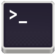

# Network Observability On Demand 1.8 Update



By: Julien Pinsonneau

Since we [introduced the Network Observability CLI](../cli/index.md), numerous features have been added. This article will cover the improvements in version 1.8 and provide some concrete examples.

## New Options Available
This update adds several options to the CLI, covering more scenarios and enabling scripting on top of the tool.

### Run in Background
The `--background` option allows you to start a flow or packet capture without connecting your terminal to the collector pod. This enables you to let the capture run in the background while you work on something else. You can check the capture's progress using the `follow` command and copy the collector output locally using the `copy` command. Once the job is complete, you can `stop` or `cleanup` everything.

### Custom Namespace
You can now customize the capture namespace using the `NETOBSERV_NAMESPACE` environment variable. When the CLI starts, it automatically checks if this namespace exists and will stop if it finds any conflict with a pending capture. This is particularly useful if you want to run captures in parallel.

### Subnets Labelling
The tool can now read configurations from `cluster-config-v1` and `network` to identify **Machine**, **Pods**, and **Services** subnets using the `--get-subnet` option. This will automatically add `SrcSubnetLabel` and `DstSubnetLabel` to your flows.

### YAML Output
Outputting a `.yml` file instead of running the capture is now possible using the `--yaml` option. The file will contain all the resources needed to run the capture, such as the namespace, the agents embedding the pipeline and its configuration, and the related services. The collector will need to be run manually in parallel to start the capture.

## Advanced Filtering
Filtering is crucial to gather precise network data without involving excessive resources and storage. The CLI focuses on this area, allowing you to deploy agents only where needed and fine-tune what's captured.

### NodeSelector
It's now possible to define agents `nodeSelector` to capture on a subset of nodes. You can rely on existing labels or create a dedicated one for this usage. For example, you can run:
```sh
`oc netobserv flows --node-selector=kubernetes.io/hostname:my-node
```
to run the agents on the node with the `kubernetes.io/hostname:my-node` label.

### eBPF Filters
Agents recently introduced the ability to filter on IPs, Ports, Protocol, Action, TCPFlags, and more simultaneously. You can now apply these filters in the CLI as shown below:

```sh
netobserv flows \                 # Capture flows
--protocol=TCP --port=8080 \      # either on TCP 8080
or --protocol=UDP                 # or UDP
```

You can add as many filters as you want and separate them by or to create multiple capture scenarios.

### Regular Expressions
If you need to filter on enriched content beyond the agent-level filters, you can use **regexes** to match any field/value pair. To filter all traffic from OpenShift namespaces, for example, you can use `--regexes=SrcK8S_Namespace~openshift.*`.

Regexes are comma-separated, so you can use multiple at once, such as `--regexes=SrcK8S_Namespace~my-ns,SrcK8S_Name~my-app`. Refer to the [flows format](https://github.com/netobserv/network-observability-operator/blob/main/docs/flows-format.adoc) to see the possible fields.

## Unified Collector UI
Capturing packets now resembles flow capture, allowing you to live filter the content. This improvement was made possible by introducing the [flowlogs-pipeline](https://github.com/netobserv/flowlogs-pipeline) component inside eBPF agents, which parse packets and generate flows from them. All filtering capabilities are compatible with this approach!

## Metrics Capture on OpenShift
Capturing metrics is now possible using the `metrics` command. This creates a `ServiceMonitor` to gather metrics from the agents and store them in [Prometheus](https://prometheus.io/). You can enable all or specific features to gather more information about your network, such in:
```sh
oc netobserv metrics --enable_all
``` 
to capture packet drops, DNS and RTT metrics or 
```sh
oc netobserv metrics --enable_pktdrop
```
to focus only on drops.

On top of the features, you can use all the filtering capabilities mentioned above to focus on what you're looking for. A `NetObserv / On Demand` dashboard will be automatically created, showing the results.


## Feedback
We hope you enjoyed this article!

Netobserv is an OpenSource project [available on github](https://github.com/netobserv).
Feel free to share your [ideas](https://github.com/netobserv/network-observability-operator/discussions/categories/ideas), [use cases](https://github.com/netobserv/network-observability-operator/discussions/categories/show-and-tell) or [ask the community for help](https://github.com/netobserv/network-observability-operator/discussions/categories/q-a).
